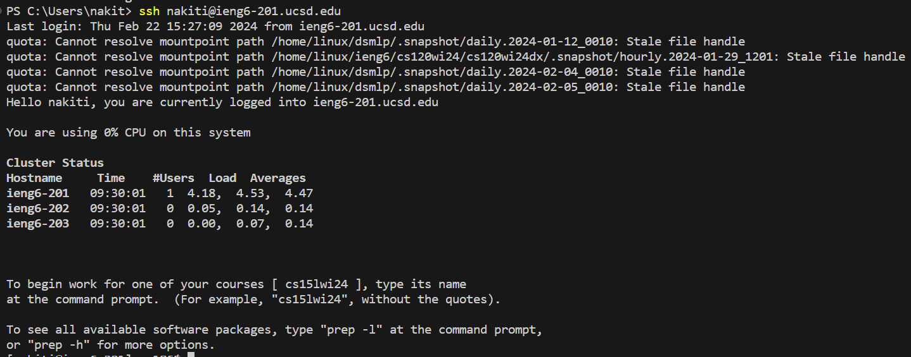
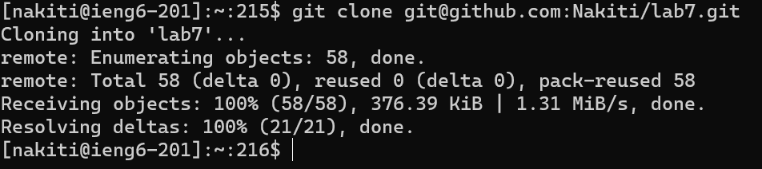
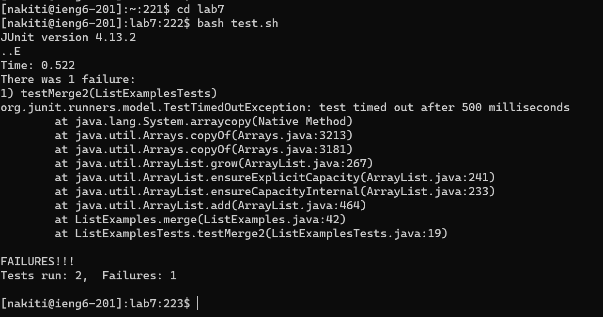
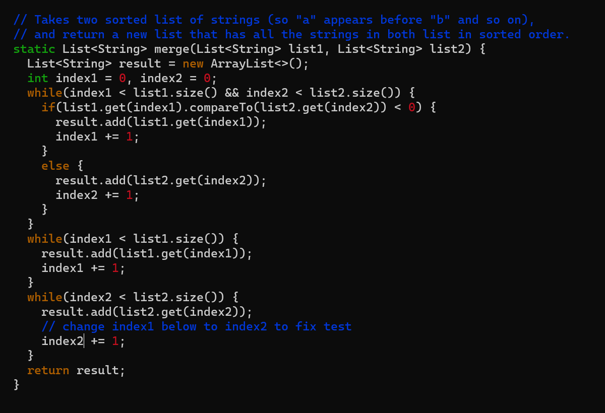
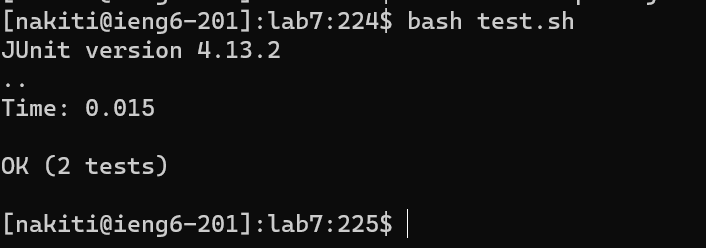
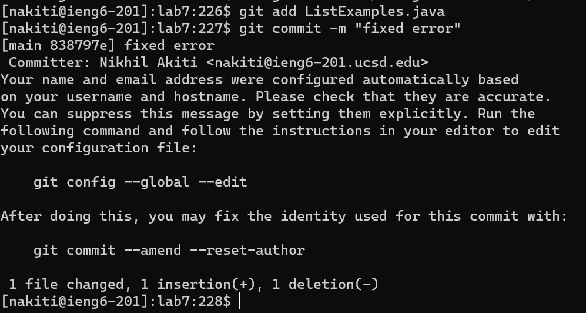

# Lab Report Four - Vim

**Step 4**

- Keys Pressed:  `s` `s` `h` `n` `a` `k` `i` `t` `i` `@` `i` `e` `n` `g` `6` `-` `2` `0` `1` `.` `u` `c` `s` `d` `.` `e` `d` `u` `<enter>`
- I first typed in the necessary letters to create the command to log into ieng6 and then pressed `<enter>` to run the command. 

**Step 5**
\

- Keys Pressed: `g` `i` `t` `c` `l` `o` `n` `e` `<ctrl>` `v` `<enter>`
- I first typed in the necessary letters to create the command to clone a git repository. Then I pressed `ctrl` and `v` simeltanesouly to copy in the ssh link to my git repository. I then pressed `<enter>` to run the command.
  
**Step 6**
\

- Keys pressed: `c` `d` `l` `a` `b` `7` `<enter>`, `b` `a` `s` `h` `t` `e` `s` `t` `.` `s` `h` `<enter>`
- I first typed in the change directory command and the name of the directory in order to naviage to the folder which contained the necessary files. From there I used the `bash` command to run the `test.sh` file which contained tests. 

**Step 7**
\

- Keys pressed: `keypad click to navigate to start of line` `l `l` `l` `l` `l` `x` `a` `h` `2` `<esc>` `:` `w` `q` `<enter>`
- I first used my keypad to place my cursor at the start of the line containing the bug. I then pressed the `l` key five times to position my cursor to the spot of the necessary change. I then clicked `x` to delete, `a` to enter edit mode, `2` to add the fix, and then `<esc>` to exist edit mode. I then typed in the command to save and exit the vim editor.
  
**Step 8**
\

- Keys pressed: `<up>` `<up>` `<enter>`
- I pressed the up arrow two times since the command to run the tests was two up. I then hit enter to run the command. 

**Step 9**
\

- `
