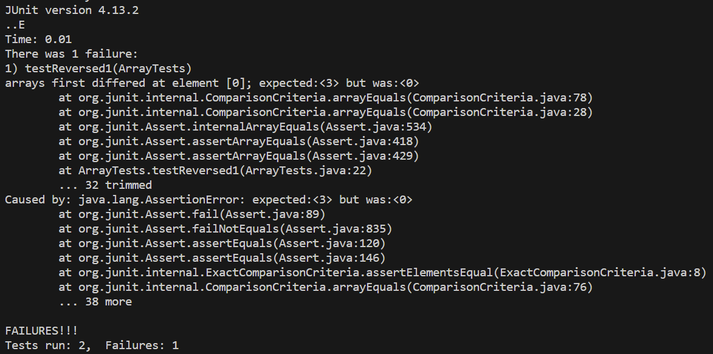

# Lab Report 3 - Bugs and Commands 
## Part 1 - Bugs
**The Bug:**
```
  static int[] reversed(int[] arr) {
    int[] newArray = new int[arr.length];
    for(int i = 0; i < arr.length; i += 1) {
      arr[i] = newArray[arr.length - i - 1];
    }
    return arr;
  }
```

**Failure Inducing Input**
```
  @Test
  public void testReversed1() {
    int[] input1 = {1, 2, 3};
    assertArrayEquals(new int[]{3, 2, 1}, ArrayExamples.reversed(input1));
  }
```

**Input That Doesn't Induce Failure**
```
  @Test
  public void testReversed() {
    int[] input1 = {0, 0};
    assertArrayEquals(new int[]{0, 0}, ArrayExamples.reversed(input1));
  }
```

**The Symptom**


**The Fix**
Before
```
  static int[] reversed(int[] arr) {
    int[] newArray = new int[arr.length];
    for(int i = 0; i < arr.length; i += 1) {
      arr[i] = newArray[arr.length - i - 1];
    }
    return arr;
  }
```
After
```
  static int[] reversed(int[] arr) {
    int[] newArray = new int[arr.length];
    for(int i = 0; i < arr.length; i += 1) {
      newArray[i] = arr[arr.length - i - 1];
    }
    return newArray;
  }
```

**Explanation**
The fix addresses the issue as prior to its implementation the original array, `arr`, was being updated instead of the new array that is supposed to be returned to the user, `newArray`. When this code was run prior to being fixed it returned an array of 0s since the values of `newArray` were never updated.

## Part 2 - Researching Commands
**Command:** `grep`
Option 1: `-l`
Example 1:
```
nakit@Nikhil MINGW64 ~/OneDrive/Documents/CSE15L/docsearch/technical (main)
$ grep "Pharmaceutical" plos/* -l
plos/journal.pbio.0020028.txt
plos/journal.pbio.0020053.txt
plos/journal.pbio.0030032.txt
plos/pmed.0010052.txt
plos/pmed.0020062.txt
plos/pmed.0020099.txt
plos/pmed.0020210.txt
```
Example 2:
```
nakit@Nikhil MINGW64 ~/OneDrive/Documents/CSE15L/docsearch/technical (main)
$ grep "epic" plos/* -l
plos/journal.pbio.0020263.txt
plos/journal.pbio.0020307.txt
plos/journal.pbio.0030056.txt
plos/journal.pbio.0030136.txt
plos/pmed.0010042.txt
plos/pmed.0020059.txt
```
- In this instance, the `-l` command is retrieving the names of the files that contain the input pattern. This is useful to see which files contain information about a particular word/topic.

Option 2: `--word-regexp`
Example 1: 
```
$ grep "out" plos/* --word-regexp
plos/journal.pbio.0020001.txt:        research money available to researchers, Latin America actually out-published the United
plos/journal.pbio.0020010.txt:        Roger Schonfeld's book draws out many of the significant points about JSTOR's place in
plos/journal.pbio.0020010.txt:        Schonfeld does not draw out is the pace of change in electronic publishing, and if so much
plos/journal.pbio.0020010.txt:        has been achieved since 1993, what promise is held out by the next ten years'!
plos/journal.pbio.0020012.txt:        “The study came out from a pretty big gamble,” recalls Sinclair, who used the human
plos/journal.pbio.0020019.txt:        ‘knocking out’ one of several genes, buffering may be lost or compromised, releasing
plos/journal.pbio.0020019.txt:        ‘knocked out’ and then, at a later time, restored. The simulated populations were allowed
plos/journal.pbio.0020019.txt:        out’ in turn and the expression of the remaining genes determined, to demonstrate that
plos/journal.pbio.0020019.txt:        This hypothesis has several testable predictions. For example, ‘knocking out’ an ion
```
Example 2:
```
$ grep "child" plos/* --word-regexp
plos/journal.pbio.0020046.txt:        is no good way of predicting whether an affected child will recover (Yairi and Ambrose
plos/journal.pbio.0020046.txt:        However, studies of personality traits and child–parent interactions did not detect
plos/journal.pbio.0020140.txt:        so naturally to humans (and are in place so early in child development) that some might
plos/journal.pbio.0020150.txt:        conclusions to the individual child. “At the moment, fMRI would be among the most useless
plos/journal.pbio.0020150.txt:        consider other factors, such as a history of child abuse, in an attempt to more fully
plos/journal.pbio.0020262.txt:        scientist looking like a small child beside Chris Greener, the tallest man in Britain, or
plos/journal.pbio.0020267.txt:        Sara Webb, a child psychologist at UW, has followed about 70 autistic children since the
plos/journal.pbio.0020267.txt:        differently from seeing a favorite toy, in the same way a normal child does. But activity
plos/journal.pbio.0020267.txt:        opportunity to be shaped by the experience and input that a typically developing child
```
- The `--word-regexp` command only returns lines that contain an exact match with the input pattern. It can be useful when the input word is a base word and can return more outputs that the intended ones.

Option 3: `--invert-match`
Example 1:
```
nakit@Nikhil MINGW64 ~/OneDrive/Documents/CSE15L/docsearch/technical (main)
$ grep "the" plos/* --invert-match
plos/journal.pbio.0020001.txt:
plos/journal.pbio.0020001.txt:
plos/journal.pbio.0020001.txt:
plos/journal.pbio.0020001.txt:
plos/journal.pbio.0020001.txt:
plos/journal.pbio.0020001.txt:        countries, asserting that “This unbalanced distribution of scientific activity generates
plos/journal.pbio.0020001.txt:        development itself.” Indeed, Mr. Annan's sentiments have also been echoed recently by
plos/journal.pbio.0020001.txt:        Goldemberg 1998; Riddoch 2000). For example, recent United Nations Educational, Scientific,
plos/journal.pbio.0020001.txt:        produced annually, with 36.6% and 37.5%, respectively, worldwide (UNESCO 2001).
plos/journal.pbio.0020001.txt:
plos/journal.pbio.0020001.txt:
plos/journal.pbio.0020001.txt:            publications produced annually.
plos/journal.pbio.0020001.txt:
plos/journal.pbio.0020001.txt:
plos/journal.pbio.0020001.txt:        developing worlds actually remaining unchanged or even increasing, as Mr. Annan has
```
Example 2:
nakit@Nikhil MINGW64 ~/OneDrive/Documents/CSE15L/docsearch/technical (main)
$ grep "a" plos/* --invert-match
plos/journal.pbio.0020001.txt:
plos/journal.pbio.0020001.txt:
plos/journal.pbio.0020001.txt:
plos/journal.pbio.0020001.txt:
plos/journal.pbio.0020001.txt:
plos/journal.pbio.0020001.txt:        serious problems not only for the scientific community in the developing countries, but for
plos/journal.pbio.0020001.txt:
plos/journal.pbio.0020001.txt:
plos/journal.pbio.0020001.txt:
plos/journal.pbio.0020001.txt:
plos/journal.pbio.0020001.txt:
plos/journal.pbio.0020001.txt:
plos/journal.pbio.0020001.txt:        2002).
```
- The `--invert-match` command returns lines that do not contain the specified input. It can be useful when you are trying to filter text files.

Option 4: `--count`
Example 


