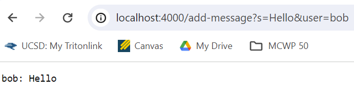
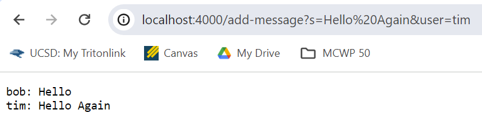
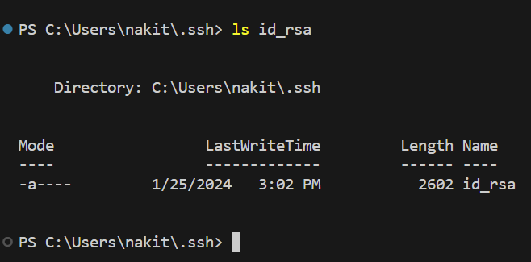
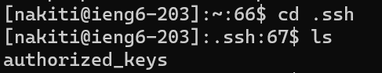
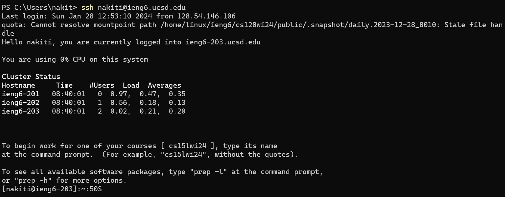

# Lab Report 2 - Servers and SSH Keys
## Part 1 
**Code for my `Chat Server`**
```
import java.io.IOException;
import java.net.URI;

class Handler implements URLHandler {
    String allMessages = "";

    public String handleRequest(URI url) {
        if (url.getPath().contains("/add-message")) {
            String[] parameters = url.getQuery().split("=");
            if (parameters[0].equals("s") && parameters[1].split("&")[1].equals("user")) {
                String s = parameters[1].split("&")[0];
                String user = parameters[2];
                allMessages = allMessages + user + ": " + s + "\n";
    
                return allMessages;
            } else {
                return "Incorrect Query Structure";
            }
        } else {
            return "404 Not Found!";
        }
    }
}

class ChatServer {
    public static void main(String[] args) throws IOException {
        if(args.length == 0){
            System.out.println("Missing port number! Try any number between 1024 to 49151");
            return;
        }

        int port = Integer.parseInt(args[0]);
        Server.start(port, new Handler());
    }
}
```
\
**Screenshot For First Usage of `/add-message`**


- In my code, the two methods called are the `main` method of the `ChatServer` class and the `handleRequest` method of the `Handler` class
- `main` method
    - Relevant Arguments: `String[] args` which is the user's input into the program
    - Relevant Fields: `int port` which is the port number that the user specifies through the previous argument
- `handleRequest`
    - Relevant Arguments: `URI url` - the url of the visited webpage which is `http://localhost:4000/add-message?s=Hello&user=bob` 
    - Relevant Fields
        - `String allMessages` - a string containing every message/user input from the user in the proper format which is `"bob: Hello \n"`
- This request changes the `parameters`, `s`, and `user` fields because a new url that must be parsed into the various fields is inputted into the program. The `allMessages` field is also changed as the new message in the format of `<user>: <message>` is added to it.

\
**Screenshot for Second Image of `/add-message`**


- In my code, only the `handleRequest` method of the `Handler` class is called
- `handleRequest` (same functionality as previous image)
    - Relevant Arguments: `URI url` - the url of the visited webpage which is `http://localhost:4000/add-message?s=Hello%20Again&user=tim`
    - Relevant Fields
        - `String allMessages` - a string containing every message/user input from the user in the proper format which is now `"bob: Hello \n tim: Hello Again"`
- This request makes the same changes as in the previous instance. It changes the `parameters`, `s`, and `user` fields because a new url that must be parsed into the various fields is inputted into the program. The `allMessages` field is also changed as the new message in the format of `<user>: <message>` is added to it.

## Part 2
**Absoulte Path to Private Key**



**Absolute Path to Public Key**



**Logging into ieng6 Without Password**




## Part 3
In the week 2 lab, I learned how to run a server on a remote computer. I learned that each server runs on a unique port and can be accessed and modified by any computers that are also on the UCSD network. These computers can access and modify the data by making different queries through url paths. 
